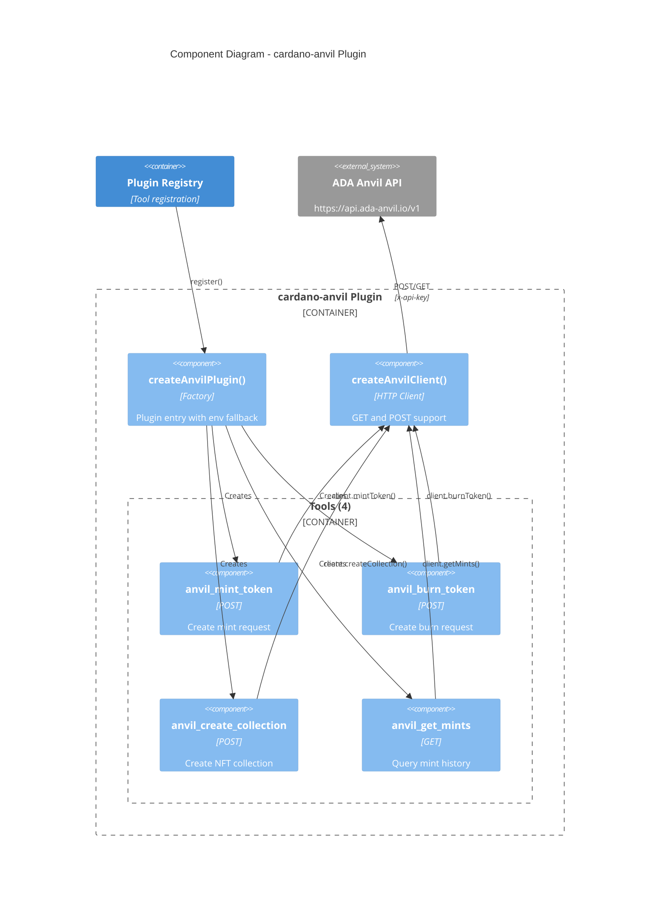
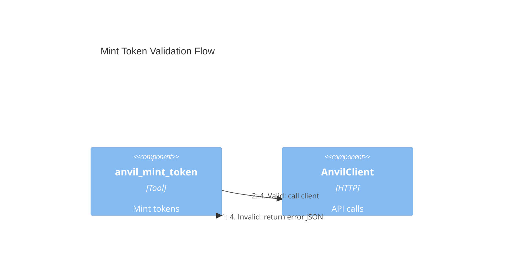

# Pluggy-McPlugFace: ADA Anvil Plugin (POST Example)

The cardano-anvil plugin demonstrates stateful operations using HTTP POST requests.



## POST Request Pattern

The anvil client supports both GET and POST methods:

```typescript
async function request<T>(method: string, endpoint: string, body?: unknown): Promise<Result<T>> {
  const headers: Record<string, string> = { Accept: "application/json" };
  if (config.apiKey) headers["x-api-key"] = config.apiKey;
  if (body) headers["Content-Type"] = "application/json";

  const res = await fetch(`${BASE_URL}${endpoint}`, {
    method,
    headers,
    body: body ? JSON.stringify(body) : undefined,
    signal: controller.signal,
  });
  // ...
}
```

## Tool Parameter Validation



Required parameters for `anvil_mint_token`:

- `name` - Token name (string)
- `quantity` - Number to mint (number)
- `recipient_address` - Cardano address (string)
- `metadata` - Optional CIP-25 metadata (object)
