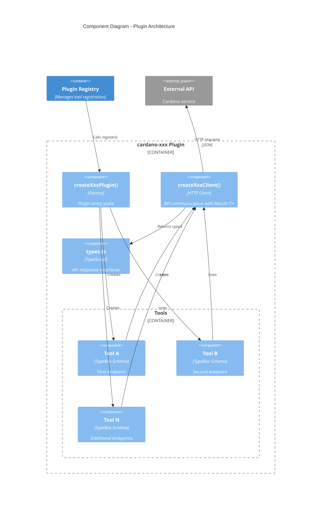

# Pluggy-McPlugFace: Plugin Component Diagram

Shows the internal structure of a single plugin (pattern shared by all 8 plugins).



## Plugin Structure

Each plugin follows the same directory layout:

```
extensions/cardano-xxx/
  package.json
  tsconfig.json
  vitest.config.ts
  src/
    index.ts          # createXxxPlugin() factory
    client.ts         # createXxxClient() with Result<T>
    types.ts          # API response types
    tools/
      tool-a.ts       # Individual tool
      tool-b.ts
      index.ts        # Tool exports
    __tests__/
      plugin.test.ts  # Registration tests
      client.test.ts  # HTTP client tests
      tools.test.ts   # Tool behavior tests
```

## Result Type Pattern

All clients use the discriminated union `Result<T>`:

```typescript
type Result<T> = { ok: true; data: T } | { ok: false; error: string };
```

This enables explicit error handling without exceptions:

```typescript
const result = await client.getTokenPrice("SNEK");
if (!result.ok) {
  return jsonResult({ error: result.error });
}
return jsonResult(result.data);
```
