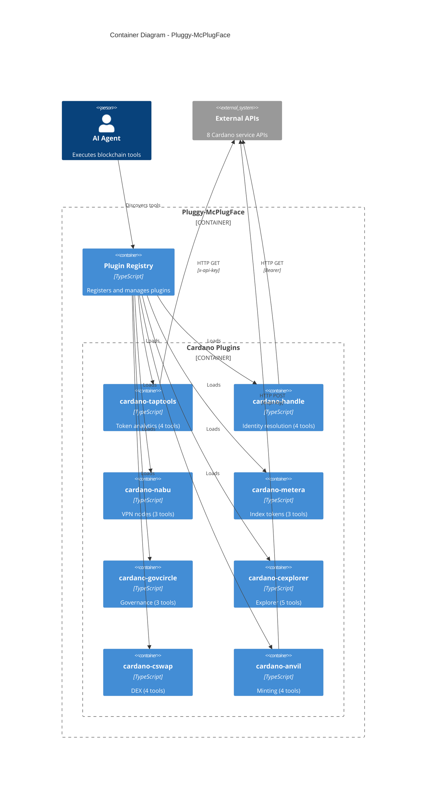

# Pluggy-McPlugFace: Container Diagram

Shows the internal structure of the plugin system.

## Plugin Inventory

| Plugin            | Tools        | Test Coverage |
| ----------------- | ------------ | ------------- |
| cardano-taptools  | 4            | 35 tests      |
| cardano-handle    | 4            | 27 tests      |
| cardano-nabu      | 3            | 21 tests      |
| cardano-metera    | 3            | 20 tests      |
| cardano-govcircle | 3            | 23 tests      |
| cardano-cexplorer | 5            | 33 tests      |
| cardano-cswap     | 4            | 26 tests      |
| cardano-anvil     | 4            | 29 tests      |
| **Total**         | **30 tools** | **214 tests** |
