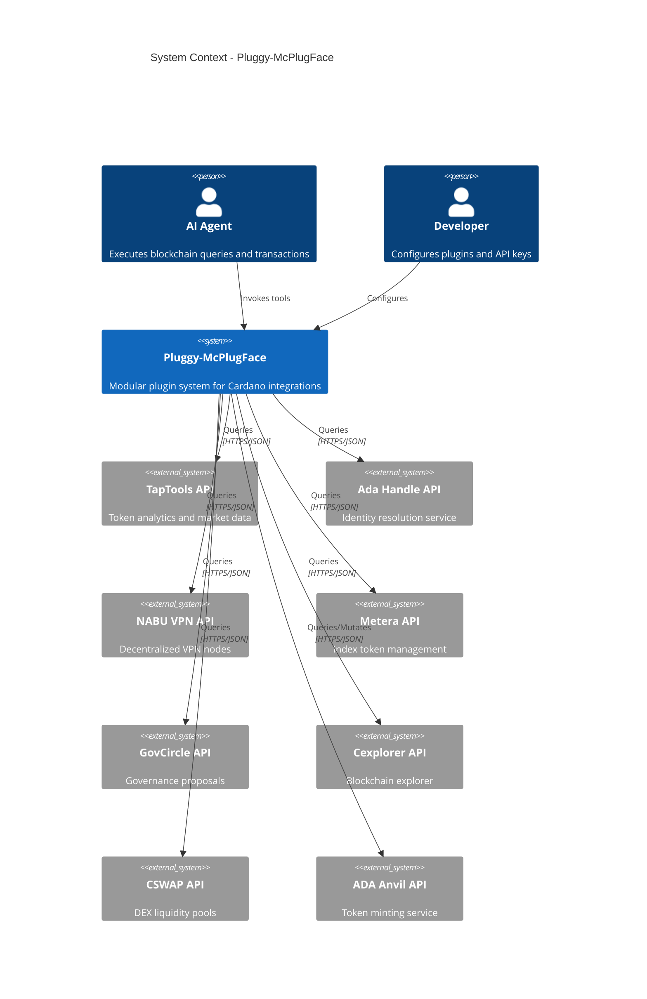

# Pluggy-McPlugFace: System Context

The Pluggy-McPlugFace plugin system provides modular Cardano blockchain integrations for AI agents.

## External Systems

| System     | Purpose                            | Auth Method |
| ---------- | ---------------------------------- | ----------- |
| TapTools   | Token prices, holders, market data | x-api-key   |
| Ada Handle | $handle to address resolution      | Bearer      |
| NABU VPN   | Decentralized VPN node info        | x-api-key   |
| Metera     | Index token composition            | x-api-key   |
| GovCircle  | Governance circles and proposals   | Bearer      |
| Cexplorer  | Address, tx, pool, epoch data      | Bearer      |
| CSWAP      | DEX pools and swap estimates       | x-api-key   |
| ADA Anvil  | Token minting and burning          | x-api-key   |
