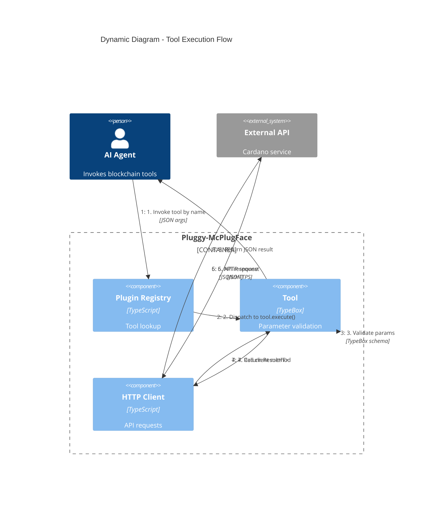
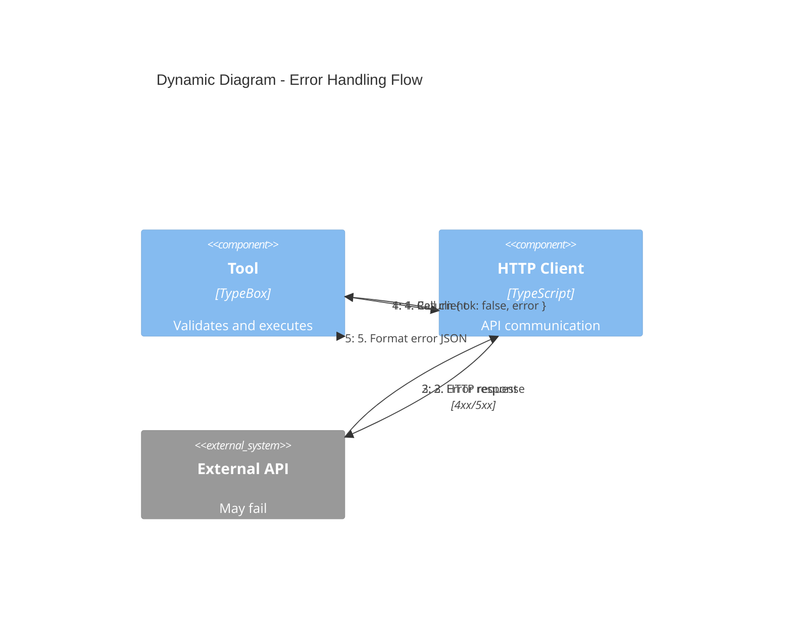

# Pluggy-McPlugFace: Tool Execution Flow

Shows the request flow when an AI agent invokes a tool.

## Execution Steps

1. **Agent invokes tool** - Agent calls `anvil_mint_token` with JSON arguments
2. **Registry dispatches** - Plugin registry finds registered tool, calls `execute()`
3. **Parameter validation** - Tool validates args against TypeBox schema
4. **Client method call** - Tool calls appropriate client method (e.g., `client.mintToken()`)
5. **HTTP request** - Client sends authenticated request to external API
6. **API response** - External service returns JSON response
7. **Result wrapping** - Client wraps response in `Result<T>` (ok/error)
8. **JSON result** - Tool formats result as JSON text content for agent

## Error Handling

Errors are handled gracefully:

- Network failures return `{ ok: false, error: "Network error" }`
- API errors return `{ ok: false, error: "API: <message>" }`
- Validation errors return `{ error: "param is required" }`
